## Watchlist API — W12D2 Advanced API Patterns

This project is a production-style FastAPI backend for a simple Watchlist application (movies and shows I want to save for later).

The purpose of this project is not the domain itself, but to practice and demonstrate real backend and infrastructure patterns including authentication, authorization, rate limiting, caching, background processing, health checks, testing, and containerized local development.

### Features
- REST API versioned under /v1
- JWT authentication (register, login, /me)
- Role-based access control (user vs admin)
- Protected Watchlist CRUD endpoints
- Redis-based rate limiting (429 responses + headers)
- Redis-based response caching with invalidation on writes
- Background task audit logging
- Request ID middleware and standardized error responses
- Health check endpoints
- Async external API integration example (GitHub)
- Pytest unit and integration tests (~85% coverage)
- Docker Compose for local development
- Optional Streamlit frontend for demo and exploration

## Project Structure

```text
app/
├── api/
│   └── v1/
│       ├── auth.py
│       ├── watchlists.py
│       ├── admin.py
│       ├── external.py
│       ├── health.py
│       └── router.py
├── core/
│   ├── security.py
│   ├── rate_limit.py
│   ├── redis_client.py
│   ├── middleware.py
│   ├── exceptions.py
│   └── audit.py
├── db/
│   ├── models.py
│   ├── session.py
│   └── deps.py
└── main.py

tests/
├── conftest.py
├── test_auth.py
├── test_watchlists.py
└── test_health.py
```

### API Endpoints
```
AUTH
| Method | Endpoint                         | Description                       |
| ------ | ------------------- -------------| --------------------------------- |
| POST   | `/v1/auth/register`              | Register a new user               |
| POST   | `/v1/auth/login`                 | Login and receive JWT             |
| GET    | `/v1/auth/me`                    | Get current user                  |
WATCHLIST(PROTECTED)
| Method | Endpoint                         | Description                       |
| ------ | -------------------------------- | --------------------------------- |
| GET    | `/v1/watchlists`                 | List items (skip/limit/type/sort) |
| POST   | `/v1/watchlists/items`           | Add item                          |
| PATCH  | `/v1/watchlists/items/{item_id}` | Update item                       |
| DELETE | `/v1/watchlists/items/{item_id}` | Delete item                       |
ADMIN
| Method | Endpoint                         | Description                       |
| ------ | -------------------------------- | --------------------------------- |
| GET    | `/v1/watchlists`                 | List items (skip/limit/type/sort) |
| POST   | `/v1/watchlists/items`           | Add item                          |
| PATCH  | `/v1/watchlists/items/{item_id}` | Update item                       |
| DELETE | `/v1/watchlists/items/{item_id}` | Delete item                       |
HEALTH
| Method | Endpoint                         | Description                       |
| ------ | ---------------------------------| --------------------------------- |
| GET    | `/health`                        | Basic health check                |
| GET    | `/v1/health/detailed`            | DB + Redis health                 |
ASYNC EXTERNAL
| Method | Endpoint                         | Description                       |
| ------ | -------------------------------- |-----------------------------------|
| GET    | `/health`                        | Basic health check                |
| GET    | `/v1/health/detailed`            | DB + Redis health                 |

```
### Local Development
Requirements
- Docker
- Docker Compose
Run
```
docker compose up --build
```
To Stop Containers
```
docker compose down
```

Services
- API: http://localhost:8000
- Swagger: http://localhost:8000/docs
- Streamlit: http://localhost:8501

Testing
```
pytest
pytest --cov=app --cov-report=term-missing
```

Postman
A Postman collection is included with example requests for:
- Auth flow
- Watchlist CRUD
- RBAC enforcement
- Rate limiting behavior (429)
- Validation errors (422)
- Health checks

## Screenshots (API + Streamlit)

These screenshots show the working endpoints and the optional Streamlit demo UI.

### Auth
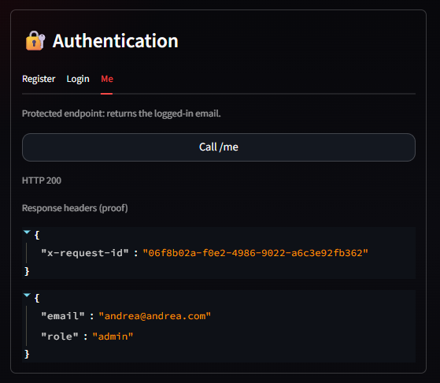

### Login + Rate Limiting
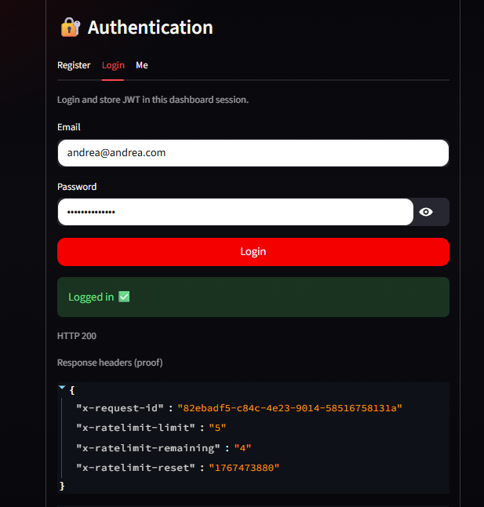
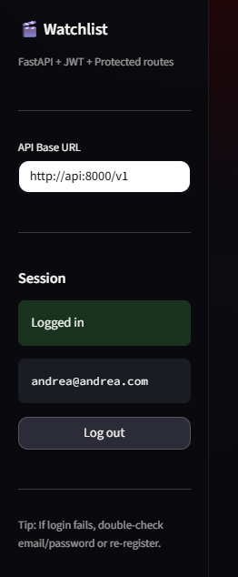
### Watchlist CRUD
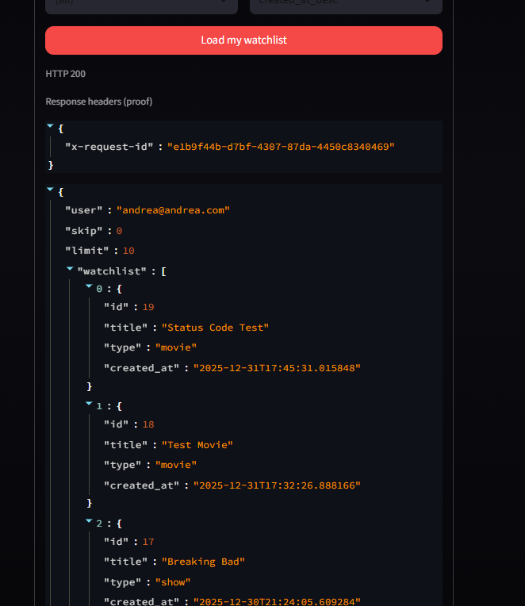

### Caching
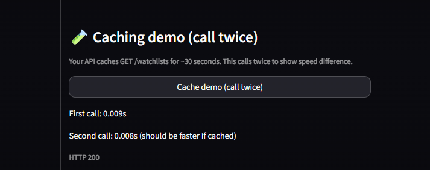

### External Async Demo
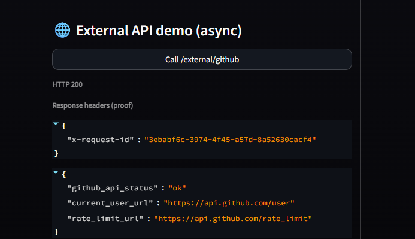

### Health Checks
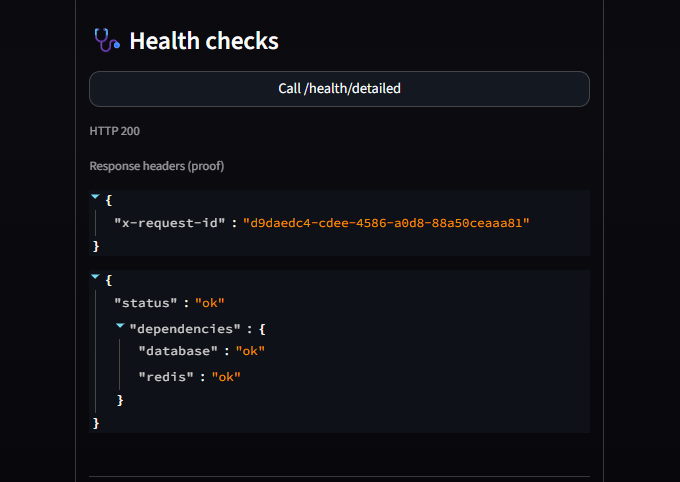

### Streamlit Frontend
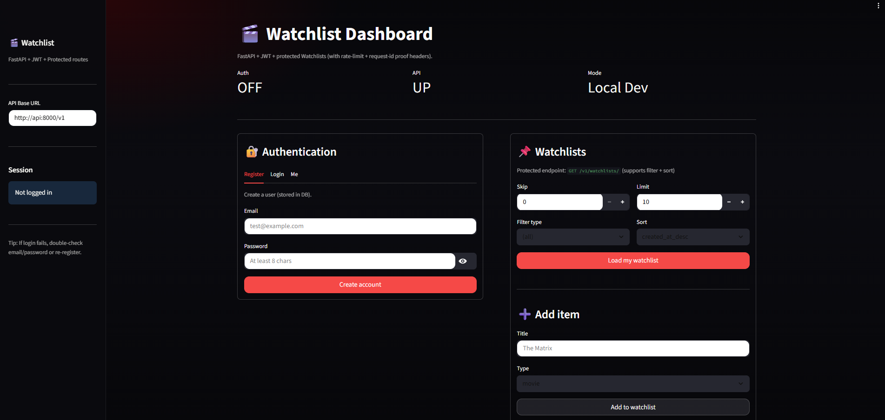

### Postman
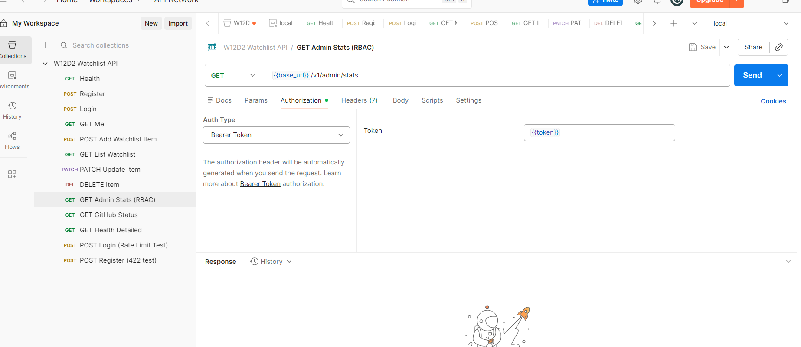

### Swagger
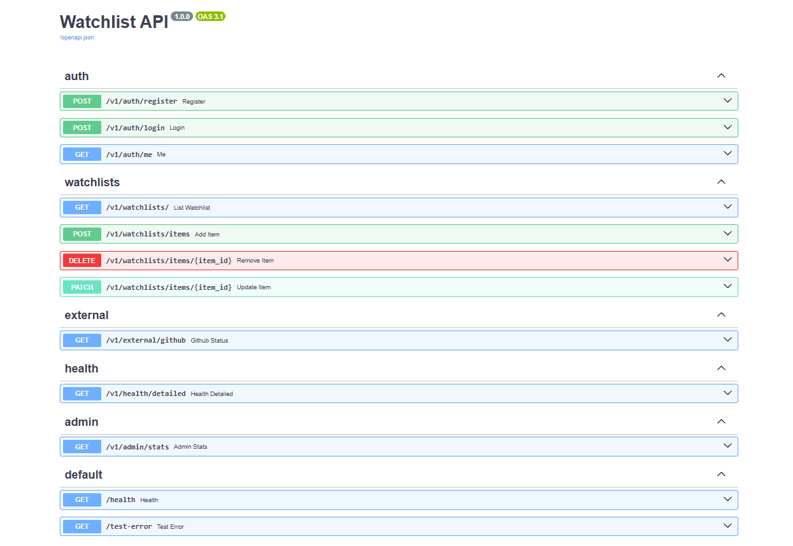

### Purpose

This project was built for the W12D2 Advanced API Patterns assignment to practice production-style backend architecture and operational concerns rather than business complexity.

The Watchlist domain was intentionally kept simple so the focus could stay on correctness, system behavior, and infrastructure patterns.

### Deployment to Render
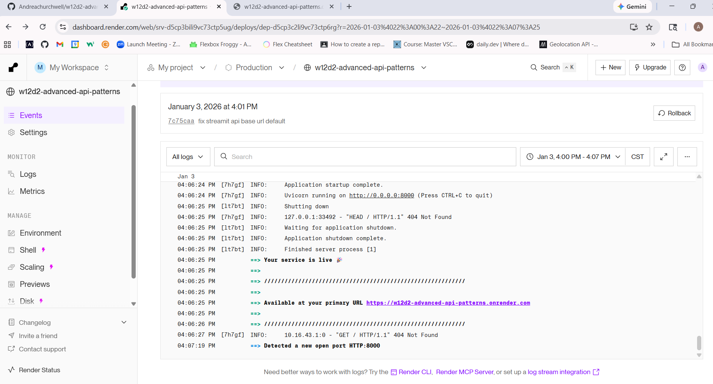

## Deployment (Render)

The FastAPI API can be deployed to Render as a Docker web service.

### Live API (Render)
- Base URL: `https://w12d2-advanced-api-patterns.onrender.com`
- Health: `https://w12d2-advanced-api-patterns.onrender.com/health`

> Note: If `/docs` or `/openapi.json` returns `Not Found`, the app may be mounted differently (ex: `/v1/docs`). In that case, verify the correct docs path via the running service routes.

### Render Deployment

These screenshots show the live deployed API running on Render.

#### Render — Swagger Docs
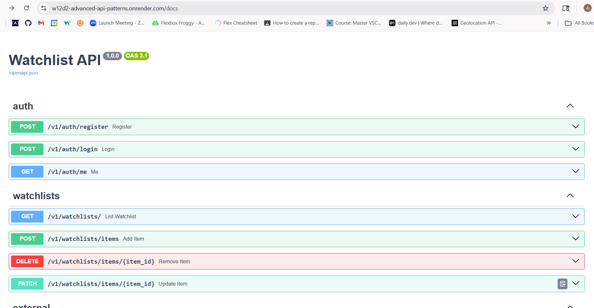

#### Render — Health Check
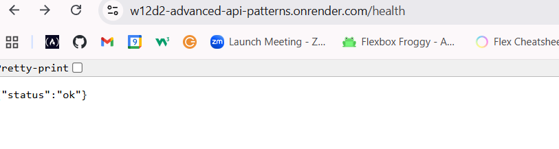

#### Render — OpenAPI JSON
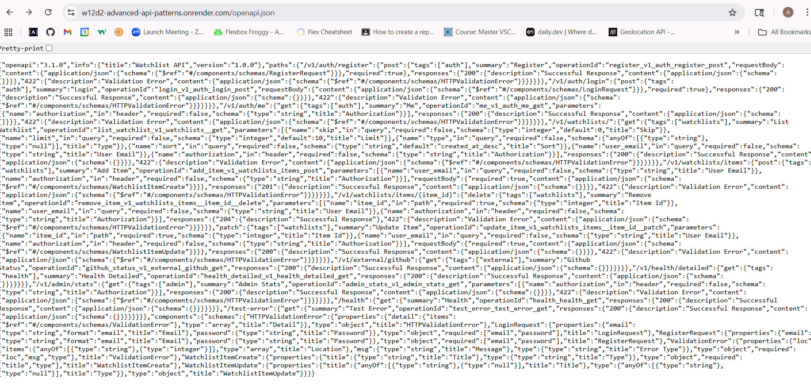


### Environment Variables (Render)
Set these in the Render dashboard:
- `JWT_SECRET` = (a strong secret value)
- `REDIS_URL` = Render Redis connection string (if using a managed Redis)
- `DATABASE_URL` = (if using Postgres later; otherwise SQLite is local only)

### Important Deployment Notes
- SQLite works locally, but it is not ideal for production deployments because the filesystem may not persist across deploys.
- Redis features (rate limiting + caching) require a Redis instance available in production.
- Streamlit is included for local Docker Compose demos. If needed, it can be deployed as a separate Render service and pointed at the API using `API_BASE_URL`.
